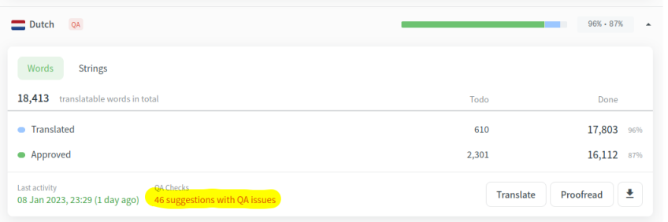
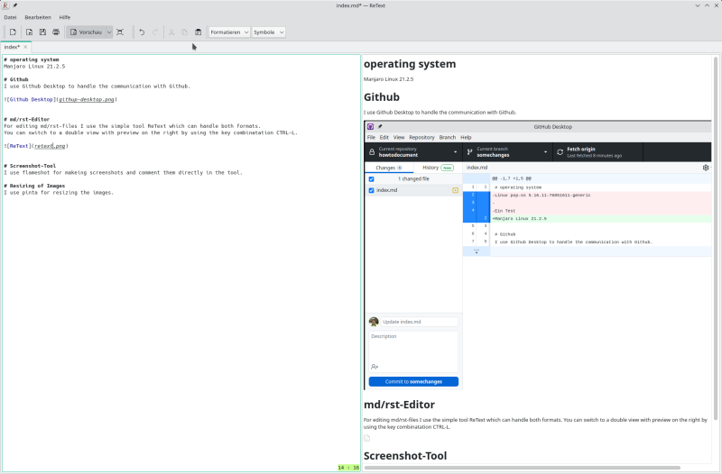
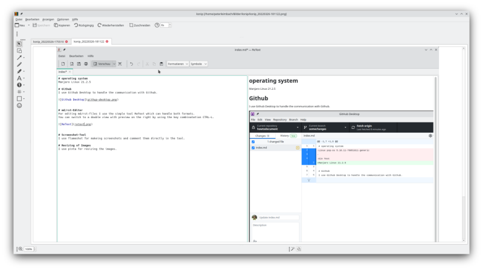
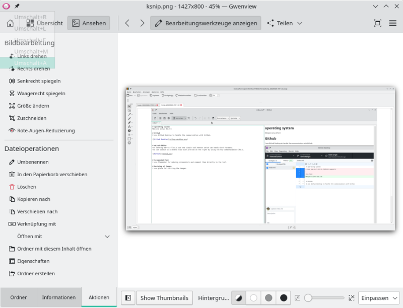
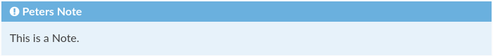
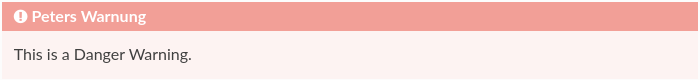

# Crowdin

Issues in Crowdin can be listed and edited under the languages overview dashboard per language.



In addition, you receive a mail that someone has created an issue and can directly work on that.

# howtodocument

Here I will document the tools I use to  work on the AndroidAPS documentation.
 
## operating system
I use **arch linux** with the **qtile** window manager.

It's not important but there are my tools available und work very well.

The window manager has some benefits if you work with several open windows in parallel and want to setup a fixed window setup with maximized size of the windows on the individual screen.

You can switch very fast between several virtual window groups. One group for development, one for web browsing, one for github, etc..

## Github
I use **Github Desktop** to handle the communication with Github.

I used the AppImage to set it up and had to install gnome-keyring manually to get it working.

Afterwords it runs very well and I have a good tool to handle the Github changes.

It's important to alwas start a branch for the work and then bring it later with a PR into the main branch.
The temporary branch can then be deleted. Maybe there is better solution later with merge a branch into another but I don't know it at the moment for sure. This way it works. ;-)


## md/rst-Editor
For editing md/rst-files I use the simple tool **ReText** which can handle both formats.

You can switch to a double view with preview on the right by using the key combinatation CTRL-L.




## Screenshot-Tool
I use **ksnip** for makeing screenshots and comment them directly in the tool.

The comment functionaltity is very good.



## Resizing of Images
I use **Gwenview** for resizing the images.



# setting up a local sphinx environment

```
export WORKDIR=$HOME/work/tryrun
rm -rf $WORKDIR
mkdir $WORKDIR
cd $WORKDIR
git clone https://github.com/peterleimbach/AndroidAPSdocs.git
python -m venv .venv 
source .venv/bin/activate 
cd .venv
```

## besser wäre, aber die Versionen sind sehr alt pip install -r requirements.txt

```
pip install --upgrade pip
pip install sphinx
pip install myst_parser
pip install recommonmark
pip install sphinx_rtd_theme

mkdir docs
cp -r ../AndroidAPSdocs/docs/EN docs/source

cp -r ../AndroidAPSdocs/docs/_static/ docs
cp -r ../AndroidAPSdocs/docs/_templates docs

cp ../AndroidAPSdocs/docs/drawing.png docs
cp ../AndroidAPSdocs/docs/favicon.ico docs

cp $HOME/work/preparemigration/.venv/docs/Makefile $WORKDIR/.venv/docs
cp $HOME/work/preparemigration/.venv/docs/shared.conf.py $WORKDIR/.venv/docs

cp $HOME/work/preparemigration/.venv/docs/source/conf.py $WORKDIR/.venv/docs/source

cd docs
make html

cd build/html
python3 -m http.server
```

# setting up qtile window manager

The configuration file is located in ~/.config/qtile/config.py.

A quick startup is via the [arch linux wiki](https://wiki.archlinux.org/title/Qtile).

The official documentation can be found [here](http://docs.qtile.org/en/stable/).

## To change the hjkl-keys to the normal cursor keys

```
Key([mod], "Left", lazy.layout.left(), desc="Move focus to left"),
Key([mod], "Right", lazy.layout.right(), desc="Move focus to right"),
Key([mod], "Down", lazy.layout.down(), desc="Move focus down"),
Key([mod], "Up", lazy.layout.up(), desc="Move focus up"),
Key([mod], "space", lazy.layout.next(), desc="Move window focus to other window"),
# Move windows between left/right columns or move up/down in current stack.
# Moving out of range in Columns layout will create new column.
Key([mod, "shift"], "Left", lazy.layout.shuffle_left(), desc="Move window to the left"),
Key([mod, "shift"], "Right", lazy.layout.shuffle_right(), desc="Move window to the right"),
Key([mod, "shift"], "Down", lazy.layout.shuffle_down(), desc="Move window down"),
Key([mod, "shift"], "Up", lazy.layout.shuffle_up(), desc="Move window up"),
# Grow windows. If current window is on the edge of screen and direction
# will be to screen edge - window would shrink.
Key([mod, "control"], "Left", lazy.layout.grow_left(), desc="Grow window to the left"),
Key([mod, "control"], "Right", lazy.layout.grow_right(), desc="Grow window to the right"),
Key([mod, "control"], "Down", lazy.layout.grow_down(), desc="Grow window down"),
Key([mod, "control"], "Up", lazy.layout.grow_up(), desc="Grow window up"),
Key([mod], "n", lazy.layout.normalize(), desc="Reset all window sizes"),
```

## To add short keys to start tools for daily use

```
Key([mod, "shift"], "a", lazy.spawn("atom")),
Key([mod, "shift"], "c", lazy.spawn("code")),
Key([mod, "shift"], "d", lazy.spawn("discord")),
Key([mod, "shift"], "e", lazy.spawn("kate")),
Key([mod, "shift"], "f", lazy.spawn("firefox")),
Key([mod, "shift"], "g", lazy.spawn("github-desktop")),
Key([mod, "shift"], "h", lazy.spawn("st -f 'Liberation Mono:size=18' -e htop", shell = True)),
Key([mod, "shift"], "k", lazy.spawn("ksnip")),
Key([mod, "shift"], "r", lazy.spawn("retext")),
Key([mod, "shift"], "q", lazy.spawn("st -f 'Liberation Mono:size=18' -e vi $HOME/.config/qtile/config.py", shell = True)),
Key([mod, "shift"], "v", lazy.spawn("vlc"))
```

# Prepare migration from rst to md

## setting up environment

### adding extension myst-parser to conf.py
```
extensions = ["myst_parser"]
```

### enable the colon_fence extension in conf.py
```
myst_enable_extensions = [
  "colon_fence",
]
```

### setting the html_theme
html_theme = 'sphinx_rtd_theme'

# New syntax for md files

## table of content
```
:::{toctree}
:caption: One Link
:glob: true
:maxdepth: 1

My Link <link.md>
:::
```
## Notes
```
:::{admonition} Peters Note
:class: note

This is a note.
:::
```



## Warnings
```
:::{admonition} Peters Warning
:class: warning

This is a warning.
:::
```
